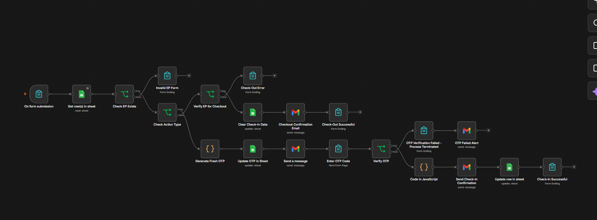

# 🕐 Employee Attendance System with OTP Verification — n8n Automation

A fully automated employee attendance management system built with **n8n** that handles Check-In and Check-Out using OTP-based email verification, Google Sheets as a database, and real-time Telegram notifications for the department head.

---

## 📸 Workflow Preview



---

## ✨ Features

- ✅ Employee Check-In and Check-Out via a form
- ✅ Employee ID validation against Google Sheets
- ✅ OTP generation and delivery via Gmail
- ✅ OTP verification before marking attendance
- ✅ Attendance record updated in Google Sheets
- ✅ Confirmation email sent to the employee
- ✅ Real-time Telegram notification to department head
- ❌ Graceful error handling for invalid IDs and failed OTP verification

---

## 🔧 Tech & Tools

| Tool | Purpose |
|------|---------|
| [n8n](https://n8n.io) | Workflow automation |
| Google Sheets | Employee database & attendance records |
| Gmail | OTP delivery & confirmation emails |
| Telegram | Department head notifications |
| JavaScript | OTP generation logic |

---

## 🔄 Workflow Overview

```
Form Submission
    └── Get Employee from Google Sheets
            └── Check if Employee Exists
                    ├── ❌ Invalid → Show Error Form
                    └── ✅ Valid → Check Action Type
                                    ├── CHECKOUT
                                    │     └── Verify EP for Checkout
                                    │               ├── ❌ Error → Checkout Error Form
                                    │               └── ✅ Success → Clear Check-In Data
                                    │                                   └── Send Checkout Confirmation Email
                                    │                                           └── Checkout Successful
                                    └── CHECKIN
                                          └── Generate Fresh OTP
                                                └── Update OTP in Sheet
                                                        └── Send OTP Email
                                                                └── Employee Enters OTP
                                                                        └── Verify OTP
                                                                                ├── ❌ Failed → OTP Failed Alert Email → Process Terminated
                                                                                └── ✅ Success → Mark Attendance in Sheet
                                                                                                    └── Send Check-In Confirmation Email
                                                                                                            └── Check-In Successful
```

---

## 🚀 How to Use

### Prerequisites
- n8n instance (self-hosted or cloud)
- Google Sheets with employee data
- Gmail account connected to n8n
- Telegram Bot connected to n8n

### Google Sheet Structure

Your employee sheet should have the following columns:

| EmpID | Name | Email | CheckIn | Status | OTP |
|-------|------|-------|---------|----------|-----|
| E001 | John Doe | john@example.com | | | |

### Setup Steps

1. **Clone or import** the workflow JSON into your n8n instance
2. **Connect credentials:**
   - Google Sheets OAuth
   - Gmail OAuth
   - Telegram Bot API
3. **Update the Google Sheet ID** in the Sheet nodes to point to your employee sheet
4. **Update the Telegram Chat ID** to your department head's chat
5. **Activate the workflow** and test with a valid Employee ID

---

## 📁 Project Structure

```
├── workflow.json         # n8n workflow export
├── README.md             # Project documentation
└── workflow-preview.png  # Workflow screenshot
```

---

## 📬 Notifications

| Event | Employee | Department Head |
|-------|----------|-----------------|
| Check-In Success | ✅ Email | ✅ Telegram |
| Check-Out Success | ✅ Email | ✅ Telegram |
| OTP Failed | ✅ Email | — |
| Invalid ID | — | — |

---

## 🛡️ Error Handling

- **Invalid Employee ID** → Form ends with an error message
- **Checkout Error** → Separate error form displayed
- **OTP Verification Failed** → Alert email sent, process terminated with a form ending

---
